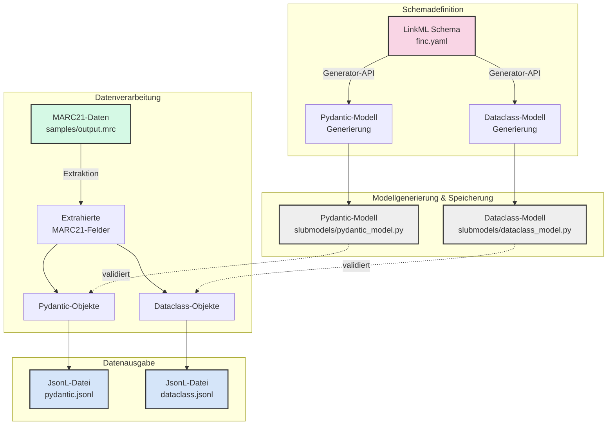
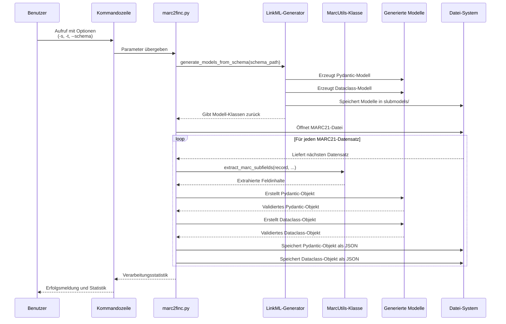
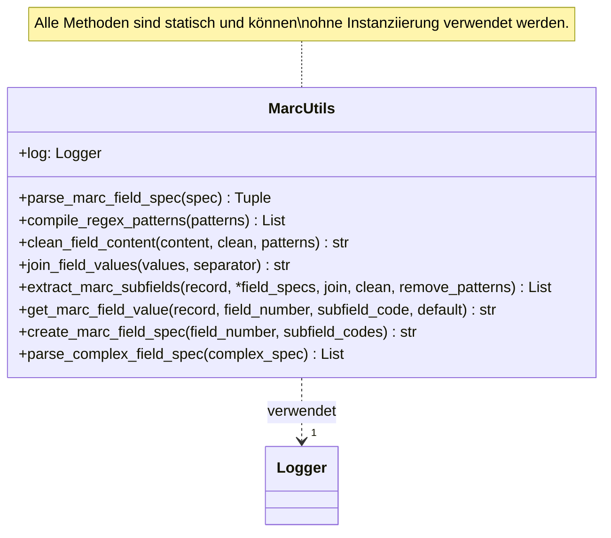

# MarcLinkFinc: Dokumentation und Visualisierung

Diese Dokumentation enthält Visualisierungen des Datenflusses und der Prozesse im MarcLinkFinc-Projekt.

## 1. Vom Schema zur JSON-Datei: Der Gesamtprozess

Das folgende Diagramm zeigt den Gesamtprozess von der Definition des LinkML-Schemas bis zur Erzeugung der JsonL-Dateien:



## 2. Der Ablauf von marc2finc.py

Das folgende Diagramm zeigt den detaillierten Ablauf der Datenverarbeitung in `marc2finc.py`:



## 3. Die MarcUtils-Klasse im Detail

Die zentrale Komponente für die MARC21-Datenextraktion ist die `MarcUtils`-Klasse. Sie bietet folgende Funktionalitäten:



## 4. Typischer Anwendungsfall

Ein typischer Anwendungsfall für die Verarbeitung von MARC21-Daten zu JSON:

```mermaid
flowchart LR
    A[MARC21-Datensatz] -->|MarcUtils.extract_marc_subfields| B[Extrahierte Feldinhalte]
    B -->|Mapping zu Modellfeldern| C[Pydantic/Dataclass-Objekt]
    C -->|json.dumps| D[JSON-Darstellung]
    
    subgraph "Beispiel"
        E["MARC Feld 245a:
        'Die Flora Deutschlands'"]
        F["Extrahierter Inhalt:
        title = 'Die Flora Deutschlands'"]
        G["Pydantic-Objekt:
        Finc(title='Die Flora Deutschlands')"]
        H["{
            'title': 'Die Flora Deutschlands'
        }"]
        
        E --> F --> G --> H
    end 